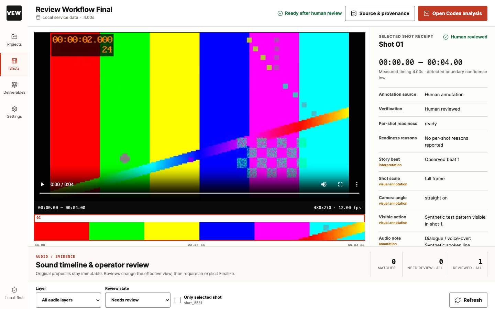
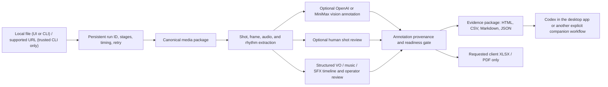
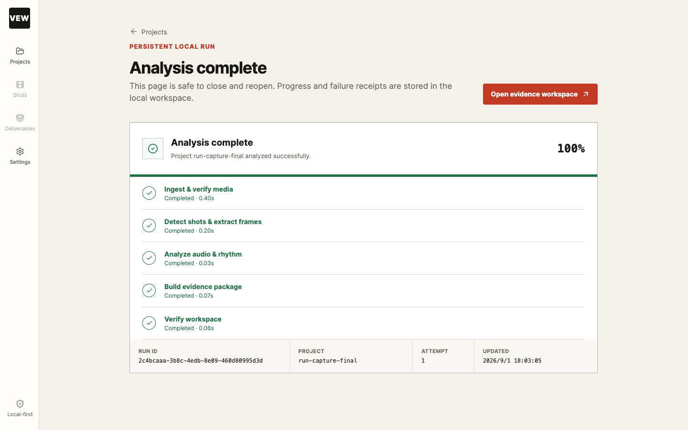

# Video Evidence Workbench

[](https://github.com/papperrollinggery/video-analysis-mvp-public/actions/workflows/ci.yml)
[](LICENSE)
[](pyproject.toml)

Turn a video into a reviewable, shot-level evidence package on your own machine.

Video Evidence Workbench is an open-source, local-first workspace for researchers and builders who need inspectable video data rather than a black-box summary. It creates timecoded shots, keyframes, contact sheets, audio and rhythm data, human-review gates, lineage records, and portable HTML, CSV, Markdown, and JSON outputs.

> Project status: v0.2.0 pre-1.0 release candidate. The deterministic short-video path, persistent run recovery, human review, explicit Finalize, migration, and requested client export passed the local candidate gates. The CI badge is the authoritative remote-build status; live provider contracts remain unverified. Shot boundaries and model annotations are evidence to review, not ground truth.



_Current production-build UI captured from a generated four-second local video after explicit shot/audio review, Finalize and requested XLSX export; no external vision provider ran. See the [review drawer](docs/screenshots/review-drawer-desktop-1440x900.png), [tablet workspace](docs/screenshots/workspace-tablet-900x1000.png), [mobile export](docs/screenshots/mobile-export-390x844.png), [persistent run](docs/screenshots/run-complete-desktop-1440x900.png), [machine-readable capture receipt](docs/screenshots/ui-acceptance-receipt.json), and [UI contract](docs/ui-frontend-design-plan.md). This is local candidate evidence, not proof of a public release, live provider accuracy or external adoption._

## First local proof

From the checkout root, with Python 3.11+ and `ffmpeg`/`ffprobe` already
installed (see the [requirements and support matrix](#requirements)):

```bash
python3 -m venv .venv
.venv/bin/python -m pip install -e .
.venv/bin/analyze-video doctor
./scripts/run-demo.sh
```

The demo uses generated media, skips ASR and external providers, and creates one
inspectable project under ignored `demo-workspace/`. Success means the manifest,
storyboard, readiness receipt and Codex handoff exist. Readiness is deliberately
`blocked` until a person reviews the evidence; that is the expected result, not
a failed demo. See the [demo contract](examples/demo/README.md).

## Why this exists

Most video AI tools optimize for a quick answer. This project optimizes for an answer you can inspect:

- every shot has a time range and primary frame;
- deterministic media extraction is separate from optional model enrichment;
- confidence and review state remain visible;
- readiness can block an evidence package when required checks fail;
- outputs are ordinary local files that other tools can read;
- a Codex handoff and visualization dataset make follow-on research explicit and portable.

It is not a hosted video-chat service, a non-linear editor, or an autonomous fact checker.

## Core workflow



The deterministic path uses `ffmpeg`, `ffprobe`, and `yt-dlp`. Local Whisper transcription and external vision providers are optional.

## Good fits

- video AI engineers building or evaluating shot-level pipelines;
- media, communication, and digital-humanities researchers;
- reviewers who need a timestamped storyboard and structured evidence table;
- ad, festival, and short-form analysts using profile-specific output language;
- teams preparing a reproducible context package for Codex or another research tool.

The default `research` profile favors general evidence review. Optional profiles (`ads`, `festival`, `shortform`, and `streaming`) tune the workflow; they do not change the product into a vertical-specific service.

## Requirements

- Python 3.11+
- `ffmpeg` and `ffprobe`
- network access only for optional, trusted-operator CLI URL ingest through `yt-dlp` and explicitly invoked external vision providers

The currently declared runtime targets are macOS and POSIX/Linux. Windows remains unverified and is not advertised as supported.

| Capability | Additional setup | Network/data boundary |
| --- | --- | --- |
| Local file analysis and synthetic demo | Base package plus `ffmpeg`/`ffprobe` | No provider call; demo is generated locally |
| Local review UI | Base package | Loopback only; no account system |
| Client XLSX | `.[export]` | No network during generation |
| Client PDF | `.[export,pdf]`, Node, Playwright module, existing Chromium and CJK font | Browser/font setup may need a deliberate download; export blocks network |
| Current Codex task | Existing Codex task plus `codex prepare/apply` | No extra provider key; submitted analysis remains unverified model output |
| OpenAI/MiniMax/BridgeDeck vision | Explicit provider/adapter configuration | Selected frames leave the core workflow only after an explicit vision action |

| Platform | Current evidence |
| --- | --- |
| macOS | Current local development and verification host |
| Ubuntu | Covered by the GitHub Actions matrix; consult the current CI run for the exact revision |
| Other POSIX/Linux | Package names, codecs, fonts and browser behavior can differ |
| Windows | Unverified and not currently supported |

Optional:

- local `whisper` plus an explicitly supplied checkpoint (`--asr-model /absolute/path/to/checkpoint.pt`) for speech transcription; no automatic model download;
- `wkhtmltopdf` only for the legacy `overview.pdf`; the professional client PDF uses the separately configured Playwright runtime described below;
- `OPENAI_API_KEY` or `MINIMAX_API_KEY` for external vision annotation on the providers' official hosts;
- a preinstalled `minimax-coding-plan-mcp==0.0.4` executable for the optional MiniMax adapter. Runtime `uvx` downloads are deliberately disabled.
- Node.js 22+ only when rebuilding or developing the bundled React frontend.

Install `ffmpeg` with `brew install ffmpeg` on macOS or, for example,
`sudo apt-get install ffmpeg` on Debian/Ubuntu. Other POSIX distributions may
use different package names; codec availability still depends on the local
build. The configured CI matrix targets macOS and Ubuntu runners. Its badge and
checks apply only to the revision shown by GitHub; no claim covers every Linux
distribution.

External vision sends selected frames only when you run `vision` or opt in with `run --with-vision`. Merely storing a key never triggers a provider call. Unset provider keys when you need a strict local-only run.

Ingest defaults to a measured 60-second limit. Use `--max-duration-seconds` only after deciding the intended project boundary. The browser and FastAPI creation surfaces accept local filesystem paths only; remote URLs require the CLI-only `--acknowledge-url-risk` flag for a trusted local operator. URL userinfo and playlist/multi-video metadata are rejected; query strings and fragments are used only for the download request and removed from persisted source receipts and command errors. Because the initial public-address check cannot confine yt-dlp redirects or later DNS resolution, prefer downloading untrusted sources separately in an egress-restricted environment.

## Next steps

Canonical repository: [papperrollinggery/video-analysis-mvp-public](https://github.com/papperrollinggery/video-analysis-mvp-public).

### Analyze your own short local video

For a deterministic first pass without ASR or external vision:

```bash
unset OPENAI_API_KEY MINIMAX_API_KEY

.venv/bin/analyze-video \
  --workspace ./analysis-projects \
  run ./path/to/video.mp4 \
  --project-id example-video \
  --profile shortform \
  --delivery-language en \
  --skip-asr
```

The command prints a JSON status envelope. Generated files are written to `analysis-projects/example-video/`.

All URL values, including apparently public URLs, use an owner-only value file
so private path/query tokens never enter argv. Acknowledge the downloader
boundary explicitly:

```bash
chmod 600 ./source-url.txt
.venv/bin/analyze-video --workspace ./analysis-projects \
  run --source-value-file ./source-url.txt \
  --acknowledge-url-risk --skip-asr
```

Never put a URL or password directly in argv. Store each value in a separate
owner-only, single-line UTF-8 file (`chmod 600`) and use
`--source-value-file` / `--password-file` with `--acknowledge-url-risk`.

### Open the local workspace

```bash
.venv/bin/analyze-video \
  --workspace ./analysis-projects \
  serve --host 127.0.0.1 --port 8787
```

The installed package includes the production React assets. Open `http://127.0.0.1:8787`. **New Analysis** accepts a local video path and immediately creates a durable run receipt under `<workspace>/.vew/runs/`. The run page survives reloads, shows stage timing and failure detail, supports cooperative cancellation at stage boundaries, and resumes failed/interrupted/cancelled work by verifying completed receipts before rerunning a stage. Each new run must use a new project ID; an existing project is never silently adopted, and a retry can reuse only the project claimed by its original run. Use the CLI deliberately when a supported public URL is required. The server enforces loopback binding and exact same-origin browser access; do not proxy it to an untrusted network.

### Run the six-case product benchmark

```bash
.venv/bin/analyze-video benchmark --output ./benchmark-output
```

This generates six redistributable synthetic videos plus five generated PCM cases without network access. `benchmark-receipt.json` records per-stage timing, boundary precision/recall, artifact completeness, pre-review readiness, deterministic silence/onset/BPM/stereo metrics, total time, Python-process peak RSS, environment, and scope. Five video cases have explicit detector gates: hard-cut cases require precision ≥ 0.8 and recall ≥ 0.5, while the three no-cut cases permit no false-positive boundaries. The fade/dissolve case is observational and cannot increase the passed count. ASR WER/CER and semantic VO/music/SFX identity accuracy remain explicit `not_run` fields, not PASS.

Run only the disposable deterministic audio cases with:

```bash
./scripts/benchmark-audio.sh
```

See the [quality metrics and test matrix](docs/quality-metrics.md) for thresholds and non-claims.



### Let the current Codex task analyze the evidence

No extra provider API key is required when the current Codex task supplies the analysis. Keep the same workflow: local evidence → model observations → human review → Finalize → requested export.

```bash
.venv/bin/analyze-video --workspace ./analysis-projects codex prepare example-video
# Codex reads the generated request/guide, inspects its exact evidence, and writes response.json.
.venv/bin/analyze-video --workspace ./analysis-projects codex apply example-video --result ./response.json
.venv/bin/analyze-video --workspace ./analysis-projects codex status example-video
```

The existing **Codex** workspace panel uses the same prepare/apply service. Results are version-checked model proposals, not human approval; no direct `shots.json` edits or automatic customer exports are needed. [Current-task guide and limits](docs/codex-desktop.md#use-the-current-codex-task-as-the-analyzer).

If evidence is missing, the built-in Codex guide tells the task to run `doctor`
and report the gap. It may run state-changing `run`, `visual`, or `audio`
commands only after you explicitly authorize that pipeline action.

### Review, Finalize, and generate client files only on request

Review every unresolved shot and audio event in the local UI. **Finalize package**
commits the current reviewed evidence; it still does not create Excel or PDF.
Install the spreadsheet extra and request XLSX explicitly:

```bash
.venv/bin/python -m pip install -e '.[export]'

.venv/bin/analyze-video --workspace ./analysis-projects \
  export generate example-video \
  --format xlsx \
  --idempotency-key client-review-v1 \
  --language bilingual
```

For the professional client PDF, install the Python PDF extra plus the pinned
Node Playwright module, then bind an existing Chromium executable and a
CJK-capable font. Browser installation is an explicit setup action and never
occurs during analysis or export:

```bash
.venv/bin/python -m pip install -e '.[export,pdf]'
npm --prefix frontend ci --ignore-scripts
(cd frontend && npx playwright install chromium)  # explicit optional setup download

export VEW_PDF_NODE="$(command -v node)"
export VEW_PDF_NODE_MODULES="$PWD/frontend/node_modules"
export VEW_PDF_BROWSER="$(node -e 'const { chromium } = require("./frontend/node_modules/playwright"); process.stdout.write(chromium.executablePath())')"
export VEW_PDF_FONT="$(fc-match -f '%{file}' 'Noto Sans CJK SC' | head -n 1)"
export VEW_PDF_FONT_NAME="Noto Sans CJK SC"

.venv/bin/analyze-video --workspace ./analysis-projects \
  export generate example-video \
  --format xlsx --format pdf \
  --idempotency-key client-final-v1 \
  --language bilingual
```

On macOS you may point `VEW_PDF_BROWSER` at an existing Chrome installation and
`VEW_PDF_FONT` at an installed Noto CJK font instead of installing Playwright's
browser. If any required PDF variable/runtime is missing, PDF generation fails
visibly; XLSX remains separately available. The UI exposes the same explicit
Generate, Cancel, Save version, Download, and Delete controls. Regeneration
replaces one `current` package; only **Save version** creates history.

### Optional: enrich shots with an API vision provider

```bash
export OPENAI_API_KEY="..."

.venv/bin/analyze-video \
  --workspace ./analysis-projects \
  vision example-video \
  --provider openai

.venv/bin/analyze-video \
  --workspace ./analysis-projects \
  report example-video \
  --delivery-language en
```

Vision output remains model-generated annotation, not ground truth. A complete provider pass can satisfy the structural gate, but consequential claims still require human verification against the source. See [privacy and provider boundaries](docs/architecture.md#trust-boundaries).

The current OpenAI adapter uses Chat Completions with initial default model `gpt-5.4-mini`; `vision --model` and `vision --limit` provide one-run overrides. It sends one validated `frame_ref` image per eligible selected shot, not the full video. The project does not estimate provider cost or control provider retention—review the full [OpenAI/Codex boundary](docs/codex-desktop.md#openai-vision-is-a-separate-boundary) before enabling it.

For MiniMax, install and verify the pinned executable before invoking the provider:

```bash
uv tool install 'minimax-coding-plan-mcp==0.0.4'
minimax-coding-plan-mcp --version  # must report exactly 0.0.4
```

The adapter will not fetch a package at runtime. If the executable is outside `PATH`, set `MINIMAX_MCP_EXECUTABLE` to its absolute path. A custom OpenAI or MiniMax endpoint never receives an ambient environment key; bind the endpoint and key explicitly in this workbench's private runtime config. Changing an endpoint clears its retained key.

## Output contract

Each project is self-contained:

```text
analysis-projects/<project-id>/
├── ingest/                 # canonical source copy
├── assets/
│   ├── review.mp4
│   ├── contact_sheet.jpg
│   └── keyframes/
├── data/
│   ├── media_package.json
│   ├── shots.json
│   ├── scenes.json
│   ├── visual_generation.json
│   ├── transcript.json
│   ├── audio_generation.json
│   ├── audio_intelligence.json
│   ├── audio_intelligence_generation.json
│   ├── vision_annotations.json
│   ├── boundary_review.json
│   ├── readiness.json
│   ├── lineage.json
│   └── visualization_dataset.json
├── reports/
│   ├── storyboard.html
│   ├── shot_list.csv
│   ├── profile_analysis.html
│   ├── report.html
│   ├── codex_handoff.md
│   ├── client/
│   │   ├── current/       # replaced only by an explicit successful export
│   │   └── saved/         # created only by Save version
│   └── ...
└── project_manifest.json
```

The exact artifact list depends on installed optional tools and the pipeline stage. `overview.pdf` is omitted when `wkhtmltopdf` is unavailable; use `report.html` in that case.

`media_package.json` contains a versioned digest receipt for the canonical master and review copy. `visual_generation.json` binds the committed keyframes, contact sheet, scenes, and measured shot structure; `audio_generation.json` binds the legacy transcript/beat/music generation, while `audio_intelligence*.json` binds the structured VO/music/SFX/silence/mixed event timeline, machine proposal, human review, and effective value. `vision_annotations.json` is a versioned run receipt with provider-specific lineage, endpoint origin, model, selected/annotated/skipped shot IDs, canonical current-shot digests, validated frame hashes/sizes/dimensions, and diagnostics. None of these receipts stores provider credentials.

`boundary_review.json` is created only when a local operator explicitly checks low-confidence cuts. It is separate from detector output, preserves the detector's confidence, and binds the reviewed shot IDs to the current visual-generation receipt. `project_manifest.json` is the report-generation commit record. Synthesis first verifies the persisted media snapshot and records the current visual/audio generation bindings plus a canonical readiness binding. That readiness binding covers the complete current shot semantics, canonical media package and on-disk media receipts, current frame/visual state, boundary-review state, and the explicit presence or absence of a vision receipt. Synthesis then marks a report generation as `publishing`, writes the package, and publishes a `committed` generation receipt last. The receipt also binds every declared report file or directory and the canonical manifest payload with SHA-256. An interrupted generation, mixed or edited source snapshot, or later byte/path change fails professional preview and download closed until the affected stage and `report` succeed again.

Two files bridge the evidence package to other OpenAI surfaces:

- `reports/codex_handoff.md` explains what to inspect and which claims still need verification;
- `data/visualization_dataset.json` provides normalized shot rows for an explicit visualization or analysis request.

They do not upload data or start another product automatically. See [Codex Desktop and ChatGPT companion workflow](docs/codex-desktop.md).

## Evidence and readiness

The v3 gate recomputes from current shots, the committed visual generation, fully decoded keyframes, media receipts, provider receipts, and the current structured audio-intelligence binding. It checks unique IDs and ordered finite timing, confined regular frame files, current master/review hashes, profile-specific critical fields, confidence/boundary thresholds, per-shot provenance, and unresolved machine/audio-review events. Missing audio intelligence remains `unknown, not silence`; a present invalid or `needs_review` timeline blocks professional export. Provider completion requires exact current-shot, frame, run/model/provider, and media bindings; `annotation_source` or a configured key alone never unlocks export. All-shot/audio human completion is an explicit assertion by the trusted local operator. The persisted `readiness.json` is a digest-bound snapshot: edits or replacements block professional preview/download until explicit re-Finalize. The report-generation receipt independently rejects partial, stale, mixed-source, aliased, or modified deliverables. A `ready` state means structural checks passed—it does not certify factual correctness, copyright ownership, or suitability for a consequential decision.

Use the primary React workspace to complete the review loop:

1. select a shot and choose **Review this shot**;
2. verify its frame, timecode, observed fields, and operator confidence;
3. explicitly confirm a low-confidence boundary when required;
4. choose **Save & next unresolved** until every shot is reviewed;
5. review every audio event in the **Sound timeline** that still requires a decision;
6. choose **Finalize package** once to regenerate the digest-bound deliverables.

The legacy evidence route remains a pre-1.0 recovery viewer: every shot stays
visible, but shot/vision editing moved to the primary workspace and retired
legacy POST endpoints return `410` with a migration instruction. Its explicit
Finalize button calls the same readiness-checked service as the primary UI;
review saves never finalize automatically. Direct JSON editing is unsupported
last-resort maintenance and invalidates bound readiness. The equivalent CLI
finalization command is:

```bash
.venv/bin/analyze-video \
  --workspace ./analysis-projects \
  report example-video
```

Saving a review is intentionally fast and invalidates the previous professional package. Finalization is a separate observable step; if it fails, the saved human edits remain recoverable and export stays blocked.

### Migrate a pre-readiness-v3 project

Migration is never automatic. Inspect one project first:

```bash
.venv/bin/analyze-video --workspace ./analysis-projects \
  migrate example-video
```

If it reports `migration_required`, explicitly prepare the migration:

```bash
.venv/bin/analyze-video --workspace ./analysis-projects \
  migrate example-video --apply
```

`--apply` takes a private transactional backup of the manifest, registry, and
migration receipt; marks legacy report/current client artifacts stale; validates
the prepared state; and restores the original metadata if any write fails. It
does not alter media, human review data, saved export versions, or generate new
documents. Repeating it is a no-op. Finish through the normal **Finalize
package** action (or `report` command), then inspect readiness and explicitly
generate a new client package. See [migration and recovery](docs/migration.md).

## Verification

```bash
python3 -m compileall -q src
PYTHONPATH=src python3 -m unittest discover -v
sh scripts/smoke-test.sh
sh scripts/demo-smoke-test.sh
sh scripts/api-smoke-test.sh
sh scripts/install-smoke-test.sh
sh scripts/benchmark-audio.sh
sh scripts/test-client-exports.sh
sh scripts/audit-test-artifacts.sh
sh scripts/verify-candidate-receipt.sh v0.2.0
.venv/bin/analyze-video benchmark --output ./benchmark-output
npm --prefix frontend run test:integration
npm --prefix frontend run test:e2e
npm --prefix frontend run build
npm --prefix frontend audit --audit-level=high
ruff check src tests
bandit -q -r src -ll
pip-audit --local --skip-editable --progress-spinner off
```

The candidate-receipt command is a release/tag gate, not a normal development
test: it verifies the product digest, mature-candidate receipt, four separately
bound evidence files, and UI evidence against the named immutable Git tree. Ordinary
pull requests still validate screenshot, frontend-source and served-asset
hashes without pretending they are the v0.2.0 release snapshot. The last three
commands require the pinned audit tools used by CI (`ruff==0.15.22`,
`bandit==1.9.4`, and `pip-audit==2.10.1`). The smoke test creates temporary
synthetic media and removes it on exit. It does not test external model
providers, password-protected sources, or every codec.

## Architecture and project direction

- [Changelog and release history](CHANGELOG.md)
- [Architecture and data contracts](docs/architecture.md)
- [Product strategy and measurable goals](docs/product-strategy.md)
- [Open-source launch, discovery and 2,000-star measurement plan](docs/open-source-launch.md)
- [Maturity benchmark and release requirements](docs/product-maturity-requirements.md)
- [Audio intelligence and client export productization plan](docs/audio-intelligence-client-export-plan.md)
- [Local PCM baseline, optional offline ASR, and capability limits](docs/audio-baseline.md)
- [Audio review CLI/API, operator decisions and explicit Finalize](docs/audio-review.md)
- [Audio intelligence data dictionary](docs/schemas/audio-intelligence-v1.md)
- [Shot/audio association data dictionary](docs/schemas/audio-associations-v1.md)
- [Professional client export template specification](docs/client-export-template-spec.md)
- [Quality metrics, licensed fixtures and layered test matrix](docs/quality-metrics.md)
- [Legacy project migration and rollback](docs/migration.md)
- [Frontend information architecture and design system](docs/ui-frontend-design-plan.md)
- [Codex Desktop and ChatGPT companion workflow](docs/codex-desktop.md)
- [FAQ and troubleshooting](docs/faq.md)
- [Festival analysis profile](docs/video-festival-analysis-workflow.md)

## Current limits

- Shot detection is a first-pass heuristic pipeline. The six-case synthetic harness currently detects the gated hard-cut cases, while the fade/dissolve observation remains below a release accuracy claim and requires human review.
- The built-in audio baseline measures PCM energy, threshold silence and onset/pulse candidates; it does not identify music, SFX, VO roles, or downbeats. ASR requires an optional trusted local tool and explicit checkpoint. Missing capability is `unknown`, not evidence of silence.
- URL ingest is a trusted-operator CLI capability requiring explicit risk acknowledgement: the initial target must resolve publicly, but downloader-controlled redirects and DNS rebinding are not an application sandbox. Signed/private values must use owner-only value files rather than argv.
- External vision behavior, cost, retention, and regional availability depend on the selected provider and model.
- Windows behavior is unverified; the supported runtime declaration currently covers macOS and POSIX/Linux only.
- The API and on-disk schemas are pre-1.0. Readiness v3/report-generation v4 are the current target; older supported versions require the explicit migration preparation and re-Finalize path above.
- There is no built-in account system, hosted collaboration, payment flow, or background cloud worker. One workspace admits one background analysis run at a time and reserves source bytes plus 256 MiB before start/retry. Local daemon threads provide only single-machine task continuity; they are not a distributed queue.
- Public release and benchmark claims apply only to the exact GitHub tag and CI
  checks linked from that release; local receipts do not substitute for them.

## Contributing and security

Start with [CONTRIBUTING.md](CONTRIBUTING.md). Private vulnerability reporting
is enabled for the canonical GitHub repository; follow [SECURITY.md](SECURITY.md)
and never put exploit details or sensitive data in a public issue.

## Citing

Research use should cite the software and the exact revision or release that
produced the evidence. Use [CITATION.cff](CITATION.cff) and the canonical
[GitHub releases](https://github.com/papperrollinggery/video-analysis-mvp-public/releases)
page.

## License

[MIT](LICENSE)
