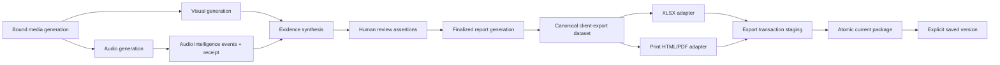

# ADR-0002: Separate audio evidence, report finalization, and client export

Status: accepted for implementation

Date: 2026-07-22

## Context

The current pipeline stages audio transcript, beat, and coarse music files, attaches summarized audio text to shots during synthesis, and commits a report-generation manifest. It also has a legacy optional `overview.pdf` path. The requested mature product needs a reviewable layered audio timeline plus professional XLSX/PDF packages without generating files on every analysis or test run.

Adding fields directly to `Shot`, placing new renderer paths in the existing hard-coded report artifact map, or adding “export” to the analysis run would couple evidence generation, review, and customer delivery. It would also weaken stale-state handling and cause unbounded files.

## Decision

Introduce four boundaries in order:

1. **Audio intelligence generation** — a versioned event dataset and receipt separate from the existing audio-generation receipt.
2. **Artifact registry** — the canonical list of artifact identity, path, kind, source generation, state, digest, and retention class.
3. **Client-export dataset** — one validated, generation-bound projection of finalized evidence for every customer renderer.
4. **Export transaction** — an explicit operation that stages, validates, and atomically publishes `current`, with explicit saved versions.

The existing analysis run remains unchanged in shape and never renders client XLSX/PDF. The existing report generation remains the prerequisite finalized evidence generation. Client export has a separate job/receipt family and may report its own progress without changing analysis-stage percentages.

## Target data flow



## Invariants

- Machine evidence, human assertions, and effective values remain separately addressable.
- Time ranges use `[start, end)` semantics; overlapping audio layers are legal.
- Missing capability yields `unknown`; overlapping/ambiguous evidence may yield `mixed`.
- Every receipt binds schema version, generation ID, parameters/capabilities, input digests, output digests, and completion state.
- A dataset can be built only from a current committed report generation.
- Renderers never read mutable project files independently once the dataset is built.
- An export can publish only after dataset, template, output, and registry validation.
- Cancellation or failure leaves the previous current package untouched.
- A related project mutation marks the export stale; it never regenerates automatically.
- Artifact paths are project-relative, unique, canonical, and confined to the project root.
- The base install does not download a model or browser runtime.

## Receipt families

| Receipt | Purpose | Commits last |
|---|---|---|
| `audio_generation.json` | existing transcript/beat/music staged snapshot | yes; unchanged compatibility contract |
| `audio_intelligence_generation.json` | new layered events and capability result | yes |
| report generation in `project_manifest.json` | finalized evidence and report artifacts | yes; prerequisite for export |
| `export_receipt.json` | canonical dataset, template, renderer, output digests and current/saved state | yes; inside published package |

The initial implementation uses a separate audio-intelligence receipt rather than expanding the existing v1 receipt with optional keys. That avoids making older readers accidentally accept partially upgraded generations.

## Artifact registry states

```text
staging → current → stale → superseded
            └────────────→ saved
staging → failed / cancelled
```

`saved` is a user retention decision, not an automatic timestamp directory. The registry may remove bounded caches and abandoned staging directories under documented rules, but never silently deletes saved versions.

## Renderer decisions

- XLSX: openpyxl generation-only adapter, formula-neutralized text, no macros/external links, structural OOXML tests, explicit visual acceptance.
- PDF: versioned print HTML/CSS rendered with an explicitly installed Playwright Chromium runtime; A4 landscape, CSS page size, print backgrounds, tagged output, layout preflight.
- Legacy `overview.pdf`: remains a separate compatibility artifact until migration tests prove removal or replacement is safe.

## Provider decisions

- Existing Whisper integration remains optional and receives explicit model/cache controls.
- Speaker diarization and source separation use provider protocols and do not enter the base dependency set.
- pyannote is a candidate optional adapter, subject to explicit model conditions/token, telemetry disclosure, resource bounds, and local schema validation.
- Demucs is not selected because the official repository is no longer maintained.
- Essentia is not linked or bundled in the MIT core because of AGPL/commercial/model licensing constraints.

## Alternatives rejected

### Add more audio strings to every Shot

Rejected because events overlap shots, long events span several shots, and provenance would be duplicated or lost. Shots may keep derived display summaries, but the event timeline is authoritative.

### Generate XLSX/PDF during synthesis or Finalize

Rejected because it hides expensive optional work, accumulates files, couples rendering dependencies to the base product, and turns evidence finalization into a delivery side effect.

### Let each renderer query the project

Rejected because XLSX and PDF would drift and could observe different generations mid-render.

### Reuse the analysis-run stage model for export

Rejected because a user can export repeatedly without re-analysis, and export lifecycle/state/retention differ from media analysis.

### Build an arbitrary template designer

Rejected for the first mature candidate. A constrained, versioned template with validated branding fields is more reliable and testable.

## Compatibility and migration

1. Old projects without audio intelligence remain readable and show the capability as unavailable/unknown.
2. The first audio-intelligence generation is additive and does not rewrite existing audio files.
3. Artifact-registry migration imports only recognized canonical artifacts and never follows symlinks or trusts existing manifest aliases.
4. Client export remains disabled until the project has a current finalized report generation and a valid export dataset.
5. Migration stages a backup/receipt, validates the new state, and restores the original on failure.

## Implementation order

1. T03 artifact registry and states.
2. T04–T06 audio schema, deterministic features, and evidence association.
3. T08 client-export dataset.
4. T09–T11 template and renderers.
5. T12–T13 export transaction and APIs.
6. T14–T17 UI and lifecycle integration.
7. T18–T22 hardening, migration, verification, and candidate freeze.

## Consequences

Positive:

- normal analysis stays lightweight;
- optional dependencies remain isolated;
- customer formats are consistent and reproducible;
- stale and failed exports are explicit;
- old projects can degrade safely.

Costs:

- more versioned schemas and receipts;
- an additional export-job state machine;
- template and renderer testing across platforms/fonts;
- UI must reconcile two long-running operation types without conflating them.

## Validation

This ADR is satisfied only when the architecture tests prove the invariants above. The document itself is not implementation evidence.
