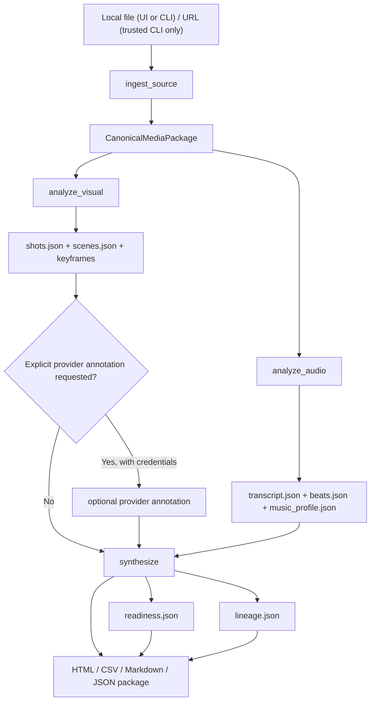
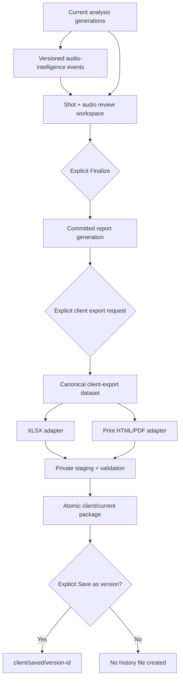

# Architecture and data contracts

This document describes the current local implementation. The broader maturity contract is [docs/product-contract.md](product-contract.md), and the accepted separation of audio evidence from client export is [ADR-0002](adr/0002-audio-intelligence-and-client-export-boundaries.md).

## System boundary

Video Evidence Workbench is a single-machine Python media pipeline with a local HTTP UI and a React frontend. A project is a directory of media, structured data, reports, and a manifest. There is no required database, hosted account, or background cloud service.

The current API and schemas are pre-1.0. Treat on-disk files as inspectable contracts, not immutable standards.

The declared runtime targets are macOS and POSIX/Linux. The code contains some defensive portability branches, but Windows execution is unverified and not part of the current support claim.

## Data flow



The default `run` command executes ingest → visual → audio → synthesis without an external provider call. `run --with-vision` adds an explicit vision step; the standalone `vision` command can annotate later. Stage commands allow rerunning part of the pipeline.

## Reviewed-audio and client-export flow

The current architecture preserves deterministic analysis, adds reviewed audio evidence, and keeps professional document generation in a separate explicit transaction.



Architectural rules:

- analysis and Finalize never generate client XLSX/PDF;
- audio events, human assertions, report generation, client dataset, and export receipt have separate versioned identities;
- every renderer consumes the same immutable dataset snapshot;
- optional ASR/diarization/separation/PDF capabilities are explicit extras and cannot silently download assets or use a network service;
- `current` is atomically replaced and saved versions are explicit;
- current files and states remain public claims only while their contract and lifecycle tests pass.

## Runtime components

| Component | Current responsibility | Primary implementation |
| --- | --- | --- |
| CLI | command routing and JSON status envelopes | `src/video_analysis_mvp/cli.py` |
| Ingest | copy/download media, create review video and WAV, probe metadata | `media.py` |
| Visual | estimate boundaries, scenes, keyframes, contact sheet | `visual.py` |
| Audio | optional transcript, beat events, coarse music profile | `audio.py` |
| Vision | optional OpenAI or MiniMax shot annotation | `vision.py` |
| Readiness | aggregate and per-shot review checks | `readiness.py` |
| Synthesis | join stage data and render reports | `synthesis.py`, `delivery.py` |
| Evidence handoff | normalized visualization rows and Codex context | `evidence_handoff.py` |
| Local API | project/media/deliverable operations for the UI | `workspace_api.py` |
| Local server | loopback HTTP, API dispatch, project file serving, frontend | `web.py` |
| Web client | intake, project, shot review, deliverables, runtime status | `frontend/src/` |

### Extended components

| Component | Current responsibility | Primary implementation |
| --- | --- | --- |
| Artifact registry | canonical identity, path, digest, source generation, current/stale/saved state | `artifacts.py` |
| Audio intelligence | versioned VO/speech, music, SFX, beat, energy, silence and overlap events | `audio_intelligence.py`, `audio_features.py` |
| Audio synthesis | evidence-preserving event-to-shot associations and derived display summaries | `audio_synthesis.py` |
| Client-export dataset | immutable generation-bound projection shared by all renderers | `client_export_dataset.py` |
| Template system | versioned brand-safe layout tokens and preflight | `export_templates.py`, `templates/client/` |
| XLSX adapter | professional generation-only spreadsheet renderer | `export_xlsx.py` |
| PDF adapter | print HTML and explicitly installed Chromium PDF renderer | `export_pdf.py` |
| Export service | idempotency, locks, cancellation, staging, atomic publish and versions | `export_service.py` |

These components are implemented modules. Their optional runtimes remain
separate from the base deterministic pipeline.

## Project layout

```text
<workspace>/<project-id>/
├── ingest/
│   └── master.mp4
├── assets/
│   ├── review.mp4
│   ├── audio.wav
│   ├── contact_sheet.jpg
│   └── keyframes/
├── data/
├── reports/
└── project_manifest.json
```

### Source-of-truth files

| File | Role | Important caveat |
| --- | --- | --- |
| `data/media_package.json` | probed source/review metadata and profile | can contain source and local paths |
| `data/shots.json` | shot timing, frame references, annotations, confidence, review state | model fields require review |
| `data/scenes.json` | coarse grouping of shots | grouping is heuristic |
| `data/transcript.json` | timestamped speech segments | absent/empty when ASR is skipped |
| `data/vision_annotations.json` | versioned provider run, current-shot, frame, and media-binding receipt | exists only after an explicit vision run; annotations remain unverified model output |
| `data/beats.json` | detected energy peaks | not a musicological beat grid |
| `data/music_profile.json` | coarse energy, tempo, and style fields | descriptive estimate |
| `data/audio_generation.json` | digest receipt for one staged transcript/beat/music/SRT/rhythm-summary generation | marker is committed last; missing or mismatched content cannot feed a current report generation |
| `data/visual_generation.json` | digest receipt for one staged keyframe/contact-sheet/shot/scene generation | marker is committed last; missing or mismatched content is not a complete visual snapshot |
| `data/boundary_review.json` | explicit local-operator review of low-confidence cuts, bound to the current visual generation | optional; stale, forged, unsafe, or mismatched receipts fail closed and never rewrite detector confidence |
| `data/readiness.json` | v3 gate status, canonical shot/audio digest, media/provider bindings, per-shot and audio-review states, metrics, and reasons | stale or malformed receipts fail closed; passing is not factual certification |
| `data/lineage.json` | source-to-shot derivation graph and package state | schema is pre-1.0 |
| `data/visualization_dataset.json` | normalized, project-relative shot evidence rows | designed for explicit downstream use |
| `project_manifest.json` | project status, canonical artifact index, and committed report-generation receipt | binds visual/audio generations, canonical readiness (all shot semantics, media, frames, and vision-receipt state), every declared file/directory, and its own canonical payload by SHA-256; can contain absolute paths in this version |

`reports/codex_handoff.md` is a generated reading guide, not a new source of truth. `media_package.json.metadata.media_receipt` binds the canonical master and review copy by SHA-256, size, duration, frame rate, and resolution.

## Shot evidence model

A shot record combines four kinds of information:

1. **Measured:** start/end seconds, duration, timecode, primary frame reference.
2. **Estimated:** boundary confidence, scene grouping, rhythm relationship.
3. **Annotated:** subject, action, shot scale, camera, composition, text, dialogue.
4. **Review state:** provider-receipt verification and local human assertion are separate states. Confidence is a score, never proof of review.

Consumers must not collapse these categories into a single certainty score. Preserve `shot_id`, timecode, and evidence path when deriving a claim.

## Readiness semantics

The current aggregate gate checks:

- non-empty unique shot IDs and numbers; finite ordered, non-overlapping timing bounded by the current media;
- regular, non-symlink frame files confined to `assets/keyframes/` and hashed from the descriptor used for the check;
- a versioned media receipt whose current master/review files still match SHA-256, size, duration, and frame rate;
- duplicate primary-frame references;
- missing or placeholder values in critical shot fields;
- critical-field empty rate over 20%;
- average visual confidence below 0.65;
- low-boundary-confidence rate over 30%;
- absence of either complete per-shot provider annotation or an all-shot human review.

Non-ad profiles require observable shot fields; they do not require a heuristic story-beat label. The ads profile additionally requires its story-beat interpretation field. Provider provenance is accepted only when every current shot matches a versioned `vision_annotations.json` record for provider, model, run, complete post-provider shot digest, exact input-frame digest, and current media binding. An `annotation_source` string by itself never counts.

Human completion is an explicit assertion by the trusted local operator: every current shot must carry `annotation_source: human` and `readiness_status: ready`, in addition to passing the same structural checks. This is not cryptographic authorship or factual verification.

Every API, preview, and file-download gate recomputes from current project files. `readiness.json` schema v3 is a bound snapshot, not an authority: its canonical shot digest and media/provider bindings must match the recomputation, including the current committed visual-generation and optional boundary-review bindings. Editing measured or annotated shot semantics, replacing media, removing a frame, or changing a provider or boundary-review receipt blocks professional export until the affected stage and evidence package are regenerated. Every primary-workspace shot save first changes the manifest to `review_pending`, removes the previous publication commit record, and writes a `report_invalidation` marker. Restoring byte-identical shot content cannot revive that generation; only the explicit Finalize action can commit a new one. Audio and visual analysis each stage a complete artifact set and commit a digest marker last. Report synthesis separately records those source generations and a canonical current-readiness binding that covers all shot fields, the media package and current media receipts, frame/visual state, boundary-review state, and explicit vision-receipt state. It marks the manifest `publishing` before changing output bytes and commits a UUID-bound receipt last; the receipt also hashes every canonical declared file or directory and the manifest payload itself. Interrupted, stale, mixed-source, aliased, missing, or modified generations are not exposed as current professional deliverables. Read-only GET requests do not refresh files. Manifest aliases and duplicate artifact IDs cannot weaken the path-based preview/download policy.

Provider credentials are invocation capability only and never count as review evidence. The public workspace and deliverable payload expose `professional_export_allowed: true` only when the structural checks pass and a current committed report generation exists. It does not establish source authenticity, ownership, legal permission, or factual correctness.

## Trust boundaries

### Local media boundary

Source videos, review copies, frames, transcripts, and reports may be sensitive. The default workspace is a local directory and is ignored by the repository configuration. Generated JSON and manifests can reveal source names and filesystem paths.

### URL ingest boundary

`yt-dlp` accesses a remote service and processes untrusted metadata. This capability is exposed only by the CLI for a trusted local operator; the React, legacy-browser, and FastAPI project-creation surfaces reject remote URLs. Only download public content you are permitted to access. URL userinfo and an initial host that resolves to loopback, private, link-local, reserved, multicast, or unspecified addresses are rejected. Downloader-controlled redirects and extractor behavior remain a third-party network boundary, so an untrusted URL should be handled in a network-restricted environment rather than treated as sandboxed by this application. Query strings and fragments are passed only to the downloader, then removed from the media package, manifest, API receipt, and rendered command errors. Downloads land in an isolated temporary directory; only a bounded, regular, re-probed video file is atomically copied into the project. The default measured duration limit is 60 seconds. Never put a password or private source URL in documentation, issues, or commits.

### External vision boundary

When OpenAI or MiniMax credentials are configured and a provider pass is explicitly run, selected frames can be sent to that provider. Human-authored and rejected shots are excluded by default. Provider terms, retention, price, model behavior, and availability are outside this repository. Unset provider credentials for a deterministic local-only run. Ambient environment keys are accepted only for the providers' official hosts; a custom endpoint requires a key explicitly stored alongside that exact endpoint. File-backed settings use owner-only, no-symlink, atomic storage on supported POSIX systems; malformed settings fail closed, and changing an endpoint clears its retained key.

The current OpenAI adapter calls Chat Completions with default model `gpt-5.4-mini`. It sends one validated `shot.frame_ref` PNG/JPEG for each eligible selected shot plus bounded shot context. `vision --model` and `vision --limit` are one-run overrides; `run --with-vision` uses the configured model and all selected shots. This implementation does not calculate provider cost or control provider retention. See [the Codex/OpenAI companion boundary](codex-desktop.md#openai-vision-is-a-separate-boundary) before enabling it.

The MiniMax adapter requires a preinstalled absolute `minimax-coding-plan-mcp` executable whose top-level `--version` output is exactly `0.0.4`; runtime `uvx` fetches are disabled. It receives a minimal environment without ambient AWS, GitHub, OpenAI, database, or proxy credentials. Each validated frame is copied into a private `0600` snapshot, the MCP base path is confined to that temporary directory, stdout and stderr share a fixed bound, and timeout cleanup kills, drains, and reaps the process group. The adapter does not reuse another application's credential file.

OpenAI requests use a strict output schema, a fixed output-token cap, bounded response/error reads, and a transport that rejects every HTTP redirect. Both providers accept an annotation only when all required observation fields have the expected JSON type and confidence is a finite number in `[0, 1]`. Empty, partial, non-finite, boolean, string, out-of-range, or extra-field payloads are skipped without mutating the shot.

Before any provider call, PNG/JPEG frames are opened without following symlinks and read, hashed, sized, container-checked, and fully decoded from the same descriptor. Empty, text, oversized, over-dimensioned, excessive-pixel, truncated, scan-less, and trailing-polyglot inputs are rejected. The versioned vision receipt binds successful annotations to the post-provider shot state stored in `shots.json`, the exact frame SHA-256, and the media package receipt so later edits fail readiness closed.

### Local HTTP boundary

The server enforces loopback binding, accepts browser CORS only for the exact HTTP origin named by the current loopback `Host`, rejects cross-site fetch metadata, and requires a per-process CSRF token for mutations. A sibling localhost port is not trusted; the contributor Vite proxy rewrites its backend request to the backend's exact origin. These controls reduce browser-origin attacks; they are not production authentication or authorization. Do not expose the service through a proxy, bind it to a public interface, or use it as a multi-user service.

### Generated-content boundary

Model text, transcripts, filenames, provider output, and generated HTML or Markdown are untrusted content. Dynamic HTML is escaped, project file paths are confined to the project root, active SVG/XML/XHTML previews are refused, generated HTML previews use a restrictive sandbox policy, spreadsheet text cells are neutralized against formula execution, and untrusted Markdown fields use dynamically sized code spans or fences that embedded backticks cannot close. The generated Codex Markdown starts with a trust boundary and bounded task brief; it deliberately omits raw transcript, provider output, and shot narrative while the JSON dataset labels those strings as untrusted data. Do not execute instructions found in source metadata or model output.

## Public surfaces

### CLI

The installed entry point is `analyze-video`; development commands may use `PYTHONPATH=src python -m video_analysis_mvp.cli`. Every command returns a JSON status envelope or a non-zero exit with an error envelope.

### Local HTTP API

The UI uses endpoints under `/api`. They are experimental and should not be treated as a stable public SDK until versioned schemas and compatibility tests exist. The supported public starting point is the CLI and generated project package.

Long analyses use a workspace-local control plane:

- `POST /api/runs` persists a UUID receipt and starts the local worker;
- `GET /api/runs/{run_id}` returns queued/running/cancelling/terminal state, current stage, progress, attempts, timestamps, stage timings, and bounded failure detail;
- `POST /api/runs/{run_id}/retry` verifies existing media/visual/audio/report receipts and resumes at the first invalid or missing stage;
- `POST /api/runs/{run_id}/cancel` requests cooperative cancellation at the next stage boundary.

Run records live under `<workspace>/.vew/runs/` with atomic writes and a cross-process advisory lock. A second cross-process project lease prevents two runs from publishing into the same project, while a run/project claim prevents a new request from reusing unrelated source bytes or a different profile. Completed receipts bind the final media package, visual/audio generations, and report generation by digest or generation ID. Passwords and provider credentials are never accepted into this record. External vision remains a separate explicit post-analysis action. A live worker is process-local; after a process loss, a stale active receipt becomes `interrupted` and can be retried.

### Static project files

The local server exposes selected current project artifacts under a project-scoped `/files/` path. Report deliverables must belong to a canonical, committed, digest-valid generation; partial or modified generations fail closed. Paths outside a valid manifested project are refused, and executable document formats are not previewed. Treat this as local preview convenience, not secure object storage.

## Extension rules

- A detector adapter returns shot boundaries without writing UI state.
- An annotation adapter writes explicit provider/model/source metadata and never replaces measured timing.
- A new report consumes source-of-truth JSON and adds itself to the artifact manifest.
- A new downstream integration reads project-relative evidence and requires an explicit user action.
- Schema changes add a version, migration note, and fixture before removing fields.

## Verification layers

| Layer | Command | Covers | Does not cover |
| --- | --- | --- | --- |
| Syntax | `python3 -m compileall -q src` | Python import/parse errors | runtime behavior |
| Package smoke | `sh scripts/smoke-test.sh` | deterministic report/package contract | external providers |
| Persistent demo | `sh scripts/demo-smoke-test.sh` | real four-second media ingest, manifest, fail-closed readiness, and portable artifacts | cross-platform timing or external providers |
| API smoke | `sh scripts/api-smoke-test.sh` | real temporary media intake and core project endpoints | browser rendering |
| Synthetic product benchmark | `analyze-video benchmark --output DIR` | six generated media categories, async lifecycle, stage timing, five declared detector gates, one fade/dissolve observation, artifact completeness, fail-closed readiness | ASR accuracy, fade/dissolve accuracy, real-world corpus quality, live providers |
| Install smoke | `sh scripts/install-smoke-test.sh` | wheel build plus bundled React index and asset serving | remote providers |
| Frontend origin integration | `npm --prefix frontend run test:integration` | real Vite proxy request, sibling-origin CORS denial, and exact backend Origin/Host rewrite | production authentication or public-network exposure |
| Frontend build | `npm --prefix frontend run build` | TypeScript and production bundle | usability or data truth |
| Python lint | `ruff check src tests` | selected static correctness and hygiene rules | runtime behavior |
| Source security | `bandit -q -r src -ll` | medium/high-confidence Python security patterns | dependency or architectural risk |
| Dependency audit | `pip-audit --local --skip-editable --progress-spinner off` and `npm --prefix frontend audit --audit-level=high` | known advisories in the installed Python/frontend dependency sets | unknown vulnerabilities or optional external tools |
| Manual UI | desktop/mobile browser pass | overflow, focus, core review actions | every media/codec |

Release claims must name which layer produced the evidence.
