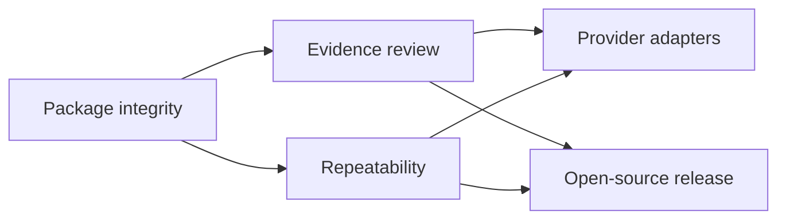

# Local-first implementation roadmap

This roadmap starts from the working Python pipeline, local HTTP service, React client, and file-based project package. It does not prescribe a new framework or hosted control plane.

## Target outcome

A new contributor can install the project, analyze one short licensed video, inspect every shot, understand why readiness passed or failed, and reuse the evidence package without a provider account.

## Current foundation

- Python 3.11+ CLI with stage commands and JSON status envelopes;
- `ffmpeg`/`ffprobe` ingest and review assets;
- trusted-operator CLI `yt-dlp` URL ingest; browser/API intake remains local-file-only;
- shot, scene, keyframe, contact-sheet, audio, rhythm, and optional transcript outputs;
- optional OpenAI and MiniMax vision annotation;
- readiness and lineage files;
- local API/web server and React frontend;
- deterministic smoke and real-media API smoke scripts.

## Workstream 1: package integrity

### Goals

- keep one project self-contained and relocatable where feasible;
- prefer project-relative references in downstream datasets;
- version public JSON schemas;
- record tool/provider versions without recording secrets;
- make partial-stage failure explicit.

### Acceptance

- a package manifest enumerates every public artifact;
- a missing optional artifact explains why it is absent;
- `reports/codex_handoff.md` and `data/visualization_dataset.json` resolve only project-relative evidence;
- smoke output contains no credential or private URL.

## Workstream 2: evidence review

### Goals

- synchronize video, shot strip, inspector, and table;
- distinguish measured, estimated, provider-annotated, and human-reviewed fields;
- expose readiness reasons at project and shot level;
- support edits without discarding annotation source or review history.

### Acceptance

- selecting a shot seeks to its start and exposes its primary frame/timecode;
- missing evidence is visible;
- provider annotations are never labeled as human;
- a blocked gate names the affected fields;
- API failure never becomes plausible demo content.

## Workstream 3: repeatability and evaluation

### Goals

- add licensed/synthetic fixtures for common editing patterns;
- normalize outputs before comparing deterministic runs;
- test fast cuts, fades, dissolves, vertical video, animation, and speech-heavy samples;
- measure boundary precision separately from semantic annotation quality.

### Acceptance

- fixture licenses and expected outcomes are documented;
- CI runs syntax, package smoke, API smoke, and frontend build;
- benchmark results name hardware, tool versions, sample set, and metric definition;
- no benchmark number appears in marketing until its reproduction assets are public.

## Workstream 4: provider adapters

### Goals

- keep provider transport out of the shot schema;
- record provider/model and annotation source;
- expose cost/data-transfer boundaries before use;
- make retry and partial annotation safe.

### Acceptance

- deterministic runs work with all provider keys unset;
- enabling a provider is observable in `doctor` and output metadata;
- a failed provider request does not erase prior reviewed values;
- tests mock provider responses and never require a real key in CI.

## Workstream 5: open-source release

### Goals

- complete license, contribution, conduct, security, issue, pull-request, and citation surfaces;
- provide one compelling licensed sample package;
- publish a short architecture and privacy boundary;
- establish a canonical upstream before adding repository URLs, badges, social preview, or package links.

### Acceptance

- README commands pass in a clean environment;
- release notes name known gaps and unverified provider paths;
- desktop and mobile screenshots show a real project;
- public files contain no absolute developer paths, passwords, private media, or price/service copy;
- release automation does not publish without an explicit maintainer action.

## Sequencing

Do not add batch scheduling, accounts, collaboration, or hosted deployment before the one-video evidence loop and schema fixtures are reliable.
