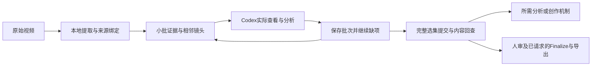

# Codex 视频分析工作流优化与验收

日期：2026-09-05。本文记录第一阶段工作流、项目 Skill 与内容验收；该阶段完成时尚未提交或发布。随后 v0.3.0 增加全局安装与公开发布，当前发布记录见 [v0.3.0](../releases/v0.3.0.md) 和 [版本候选回执](../evidence/mature-candidate-receipt.json)。历史分析项目和全局导演 Skills 未改写。

## 它解决什么工作

Workbench 把视频变成可回查的镜头、图像、声音及时间码证据；当前 Codex 查看证据并完成用户的分析问题。适用成果包括片段问题定位、完整拆片、参考机制提炼、复拍准备，以及经过复核的客户文档。参考迁移可接现有 `film-breakdown-distiller`，无需另建导演系统。

新增项目入口：[`$video-evidence-workbench`](../../.agents/skills/video-evidence-workbench/SKILL.md)。它按请求选择交付物，复用已提取证据，指导 Codex 看图、分批续做、复核关键主张，再交付用户需要的内容。



模型标注、人工审核和正式导出各有独立状态。字段齐全、机器分段数量或一次 `applied`，都不能替代实际画面核对。

## 已修复的问题

| 问题与证据 | 改动与验收 |
| --- | --- |
| 19 镜历史样例的复拍与反推 Markdown 只写前 12 镜，遗漏结尾；反推文档仍达 37,642 bytes | 两份文档覆盖完整选集；共享约束写一次。反推 Markdown 为 22,648 bytes，覆盖 19 镜；复拍简报因补齐内容从 4,606 增至 6,954 bytes |
| 每镜重复四套模型模板；未知内容也得到固定开头与风格建议 | Markdown 保留逐镜事实、证据及控制；完整模型适配继续由已有 JSON 提供。无具体证据时保留待复核状态 |
| 成功分析后再次 prepare 改写请求，使旧回执失效 | 默认复用有效提交；显式 `--refresh` 才重分析。保留 v1 请求/回执兼容 |
| 全量响应一次完成、超过 256 镜直接失败 | 新请求支持最多 1024 镜；`next` 默认 12 镜，`submit` 保存进度；只在选集完整时提交，支持重复请求、纠正和失败重试 |
| 原生请求只列主帧，动态字段缺乏时间上下文 | v2 请求绑定已有的有序支持帧，批次包含相邻镜头；保留静帧与连续运动的证据区别 |
| 只有一个真实切点时回退固定分段；极短片越界或抽到不存在的帧 | 保留实测切点与正片长；显式传递帧率并约束采样。真实 4 秒切点、100 fps 短片、25 fps 单帧/双帧通过 |
| 最后写回执失败，镜头已变更，无法继续 checkpoint | 捕获提交异常后恢复镜头、回执、registry、manifest；实际回执写失败注入后可 `submit --finish` |
| 混合人工与 Codex 标注时，验证器错误要求模型覆盖人工行 | 按绑定选集验证；人工记录独立处理，后续单行人工替代不撤销其他模型行的绑定 |
| 原片无音轨时 ingest 失败 | 原生支持无音轨：不生成 WAV 或人工静默，不产生声音事件；验证时复核真实源/审阅视频，拒绝伪造无音轨声明和矛盾声音记录 |
| 旧测试有两个偶发失败，影响全套测试可信度 | 无效响应 fixture 先消费 stdin，稳定测试 JSON 错误；并发 fixture 使用一次全局 patch，避免线程交叠破坏 PATH 和函数恢复 |

历史样例还存在 Codex 自称 `human-reviewed` 的记录。本次保留原件并明确其证据边界；它们不作为本次人工验收证明。

## 效率与实际效果

257 镜合成结构样例中，全量请求为 **756,638 bytes**，12 镜批次为 **22,286 bytes**，单次传入上下文的序列化内容减少 **97.1%**。这只衡量输入文件量，不代表账单、token 使用量或整片计算时间同比下降。来源校验和提交前重验保留。

独立实际使用测试采用 4 秒、两段运动的原始无音轨视频。Codex 查看原生帧，按两次单镜批次提交并续做，主线程回读源文件哈希、回执和图像。首段为红色方块向右移动；第二段在 2 秒硬切后为青蓝方块向下移动。原片与 ingest master 字节一致；WAV 不存在；最终 2/2 为 `codex` 标注，保持待人审。

测试也发现并纠正了两类行为问题：最初用人工静音载体绕过失败，因此该次运行未被采用；一处“方块分裂”的无依据文字，经准确绑定帧回看后通过原生刷新/提交更正。Skill 增加了原片失败处理和关键主张回查要求。最终测试成果可通过验证回执中的请求 ID 追溯。

## 验证范围

最终自动化与实际使用状态见 [本次验证回执](../evidence/codex-skill-optimization-2026-09-05.json)。覆盖：

- 完整 Python 回归，含真实 XLSX、PDF、LibreOffice、媒体、并发和失败恢复测试；显式要求导出运行环境可用。
- 前端生产构建、来源隔离、7 项 PDF 驱动检查、桌面/平板/手机浏览器交互。
- package、demo、API、review/Finalize 与干净候选 wheel 安装检查。
- 六类视频及五类声音合成 benchmark、Ruff、Bandit、Skill 格式校验。
- 新 Codex 进程 `skills/list(forceReload=true)` 发现项目 Skill；当前 Codex 的真实证据查看、提交、纠正与回读；独立冷审。

测试依赖安装在临时隔离环境，未改变项目依赖声明。旧 `codex exec` 对当前默认模型返回“requires a newer version of Codex”，因此独立 CLI 模型推理记为 `TOOL_BLOCKED`；新进程 Skill 发现和当前宿主内的实际使用分别验证，没有把 catalog 发现当成模型执行。

本次没有验证真实外部视觉/声音 provider、转录准确率、任意视频的语义正确率、VFR 精确 PTS 或断电恢复。CFR 采样网格不是实际逐帧 PTS。捕获异常支持回滚；SIGKILL/断电仍需保留恢复目录并人工处理，不宣称自动恢复。上述边界不以结构检查或合成 benchmark 的通过代替。

## 直接使用

在本项目的 Codex 任务中调用：

```text
$video-evidence-workbench 分析这个视频，重点拆解动作、镜头关系和声音，给我完整且可回查的结果。
```

CLI 批次入口与恢复方法见 [Codex 原生流程](../codex-native-analysis.md#bounded-batches-in-the-cli-and-project-skill)。已经完成的分析不需重做；重开任务后仍使用相同 workspace/project 继续。
